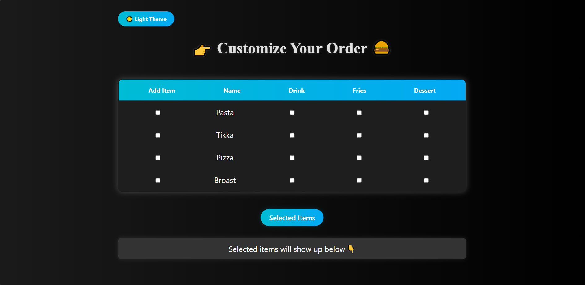

# 🛒 Item Collector (JavaScript Day 2)
**Live Demo:** [Click Here]((https://item-collector.vercel.app))

A sleek and interactive **Item Collector App** built using **pure JavaScript DOM manipulation**, styled with **CSS for responsiveness and gradients**.  
Every element — from buttons to item lists — is dynamically created and managed using JavaScript, with no static HTML structure.

---

## 🚀 Features
✅ Add and display menu items dynamically (Pasta, Pizza, Tikka, Broast)  
✅ Add extras like Drink, Fries, and Dessert  
✅ Dark 🌙 / Light ☀️ theme toggle  
✅ Input validation to prevent empty selections  
✅ Remove or clear selected items easily  
✅ Modern gradient backgrounds and hover animations  
✅ Fully responsive layout for all screen sizes  
✅ Lightweight — no frameworks or libraries used  

---

## 🧱 Tech Stack & Architecture
- **Frontend:** JavaScript (DOM API) + CSS (Responsive)
- **Dynamic Elements:** Created via `document.createElement()` and appended via JavaScript  
- **Theme Toggle:** Managed through event listeners and CSS variables  
- **Item Logic:**  
  - Adds selected items to a visible list  
  - Handles “extras” dynamically  
  - Provides real-time display of selected data  

---

## 🧠 How It Works
1. The entire app interface (buttons, checkboxes, labels, etc.) is generated dynamically using JavaScript.  
2. When users select items and click **Show Selected**, JavaScript collects their choices and displays them instantly.  
3. Theme toggle button switches between dark and light themes using CSS variables.  
4. The layout and styling adapt automatically to any screen size.  

---

## 💡 Learning Goals
This project helps you master:
- DOM Manipulation  
- Event Handling  
- Conditional Logic  
- Dynamic UI Creation  
- Responsive Styling in JavaScript  

---

## 📸 Preview

---

## 🛠️ Developer Info
👨‍💻 **Developer:** Kabeer Hussain  
📘 **Series:** JavaScript — *30 Days, 30 Projects*  
📆 **Day:** 2 — *Item Collector using DOM*  
📧 **Email:** codealpha0786@gmail.com  
🔗 **GitHub:** [ITechKabeer](https://github.com/ITechKabeer)

Made by Kabeer Hussain ❤️ 

